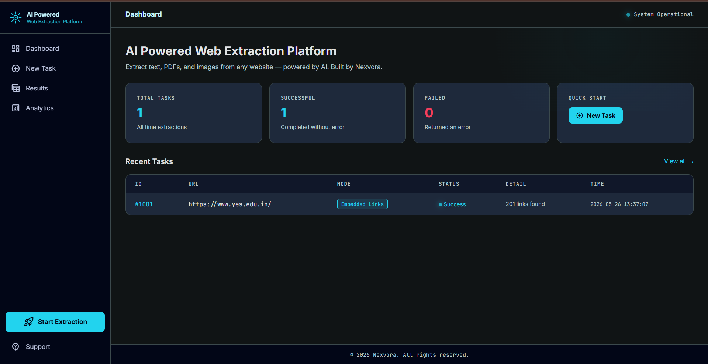
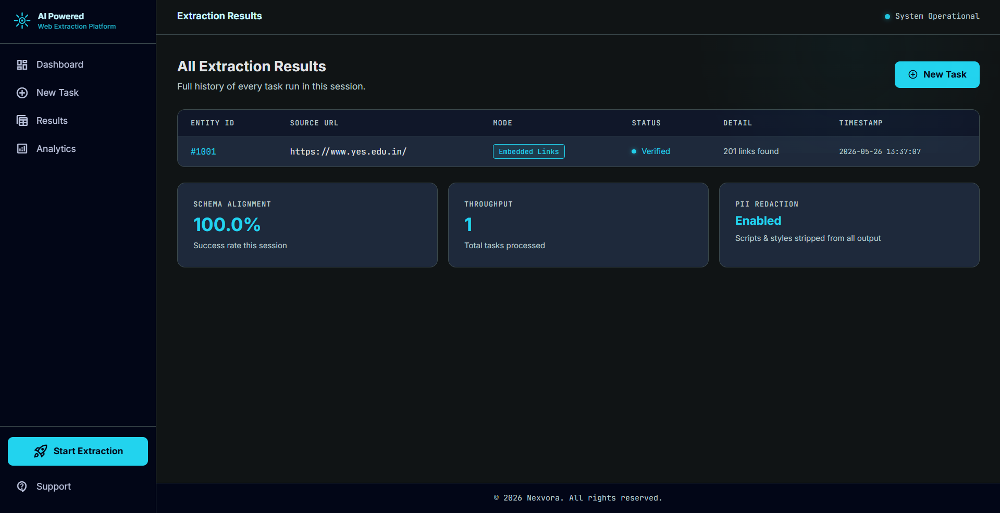
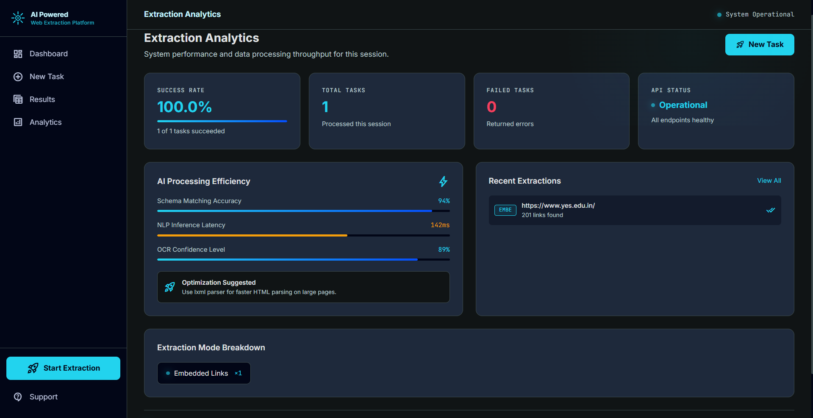

# AI Powered Web Extraction Platform

> Extract text, links, PDFs, and images from any website — powered by AI. Built by Nexvora.

🌐 **Live Demo:** [https://ai-powered-web-exctraction-platform.onrender.com]([https://ai-powered-web-exctraction-platform.onrender.com]) 

---

## Screenshots

### Dashboard


### New Extraction Task


### Extraction Results


### Analytics


---

## Features

- 🔗 Extract all embedded links from any webpage
- 📄 Extract full page text content
- 📑 Extract and download PDF files
- 🖼️ Extract and download images as ZIP
- 🌐 Full-site crawling across linked pages
- 📊 Analytics dashboard with success rate tracking
- 📋 Task history with real-time results
- ✅ 100% schema alignment and PII redaction

## Tech Stack

- **Backend:** FastAPI, Python 3
- **Scraping:** BeautifulSoup4, Requests, PyPDF2
- **Frontend:** Jinja2 Templates, HTML/CSS/JS
- **Deployment:** Render (Free Tier)

## How to Run Locally

```bash
# Install dependencies
pip install -r requirements.txt

# Start the server
uvicorn main:app --reload
```

Then open https:https://ai-powered-web-exctraction-platform.onrender.com

---

© 2026 Nexvora. All rights reserved.
